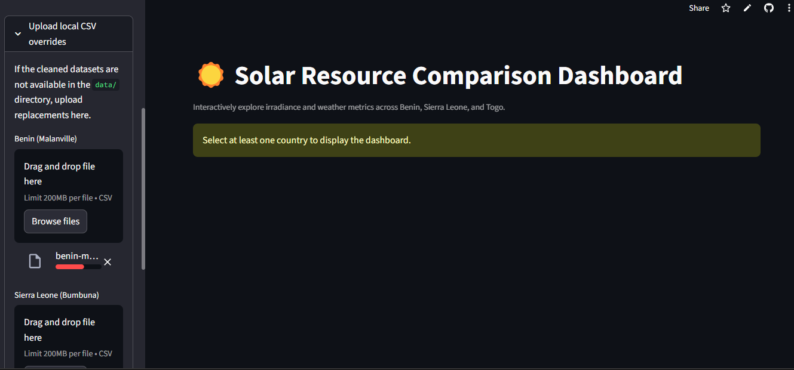
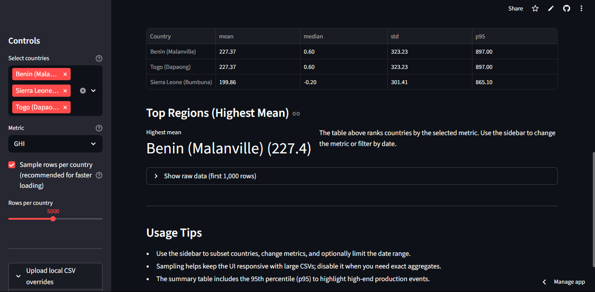

# Solar Challenge Week 0

This repository contains the end-to-end workflow for **Week 0** of the Solar Challenge. It covers local environment setup, country-level exploratory data analysis (EDA), cross-country comparisons, and a bonus Streamlit dashboard for interactive insight sharing.

---

## Project Structure

```
├── app/                     # Streamlit dashboard package
│   ├── __init__.py
│   ├── main.py              # Main UI logic
│   └── utils.py             # Data-loading and summarisation helpers
├── notebooks/               # Jupyter notebooks for country EDAs & comparison
│   ├── benin_eda.ipynb
│   ├── sierraleone_eda.ipynb
│   ├── togo_eda.ipynb
│   └── compare_countries.ipynb
├── reports/
│   └── week0_task_report.txt
├── scripts/
│   ├── __init__.py
│   └── README.md            # Deployment notes for the dashboard
├── tests/                   # Placeholder for future automated checks
├── .github/workflows/       # CI configuration
├── requirements.txt
└── README.md
```

> :warning: **Data policy** – cleaned CSVs live under `data/` but are ignored in version control. Download/generate them locally before running notebooks or the dashboard.

---

## Environment Setup

### Prerequisites

- Python 3.11+
- Git
- (Optional) Conda if you prefer managing environments that way

### Installation Steps

1. **Clone the repository**

   ```bash
   git clone https://github.com/yourusername/solar-challenge-week0.git
   cd solar-challenge-week0
   ```

2. **Create & activate a virtual environment**

   ```bash
   python -m venv .venv
   # Windows
   .venv\Scripts\activate
   # macOS / Linux
   source .venv/bin/activate
   ```

   _(Alternatively, `conda create -n solar-challenge python=3.11` then `conda activate solar-challenge`.)_

3. **Install dependencies**

   ```bash
   pip install --upgrade pip
   pip install -r requirements.txt
   ```

4. **Optional: run CI check locally**
   ```bash
   pip install pre-commit
   pre-commit run --all-files
   ```

---

## Reproducing the Analysis

1. **Prepare data** – place cleaned CSVs in the `data/` directory:

   - `data/benin-malanville_clean.csv`
   - `data/sierraleone-bumbuna_clean.csv`
   - `data/togo_clean.csv`

2. **Country EDA notebooks** – open each notebook under `notebooks/` and run all cells. They cover:

   - Summary statistics & missing value audits
   - Outlier detection (Z-score) and cleaning
   - Time-series and seasonal patterns
   - Cleaning impact on module output
   - Correlation, scatter, and wind analyses
   - Humidity vs. temperature/irradiance relationships

3. **Cross-country comparison** – execute `notebooks/compare_countries.ipynb` to generate:

   - Boxplots comparing GHI/DNI/DHI
   - Aggregated mean/median/std table per metric
   - ANOVA & Kruskal–Wallis p-values
   - Ranked bar chart for average GHI
   - Markdown summary of key findings

## Streamlit Dashboard

### Local Run

```bash
streamlit run app/main.py
```

Features:

- Country multi-select with optional CSV uploads (for deployments without bundled data)
- Metric selector (GHI/DNI/DHI/etc.)
- Sampling toggle to keep the UI responsive
- Boxplot visualisation, summary table (mean/median/std/p95), and top-region callout
- Raw-data preview and usage tips

### Deployment

See `scripts/README.md` for Streamlit Community Cloud instructions, including how to upload CSVs and configure the entry point.

### Dashboard Screenshot

[Visit Deployed Streamlit Dashboard]([https://tihitna-22-solar-challenge-week0-appmain-dashboard-dev-v0wx8g.streamlit.app/])





_(Screenshot depicts the dark-themed dashboard highlighting Benin’s lead in mean GHI and matching Togo’s distribution.)_

---

## Continuous Integration

A lightweight GitHub Actions workflow (`.github/workflows/ci.yml`) runs on Pull Requests to confirm the environment installs successfully via `pip install -r requirements.txt` (extendable to tests later in the challenge).

---

## Acknowledgements

- 10 Academy mentors
- 10 Academy community for support and discussions

For questions or improvements, open an issue or submit a PR. Happy analysing! 🌞
